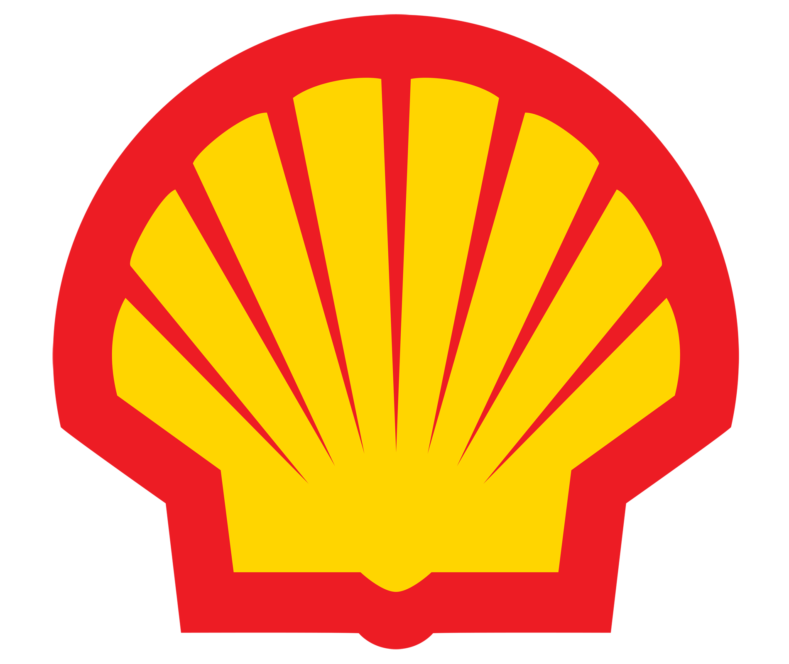
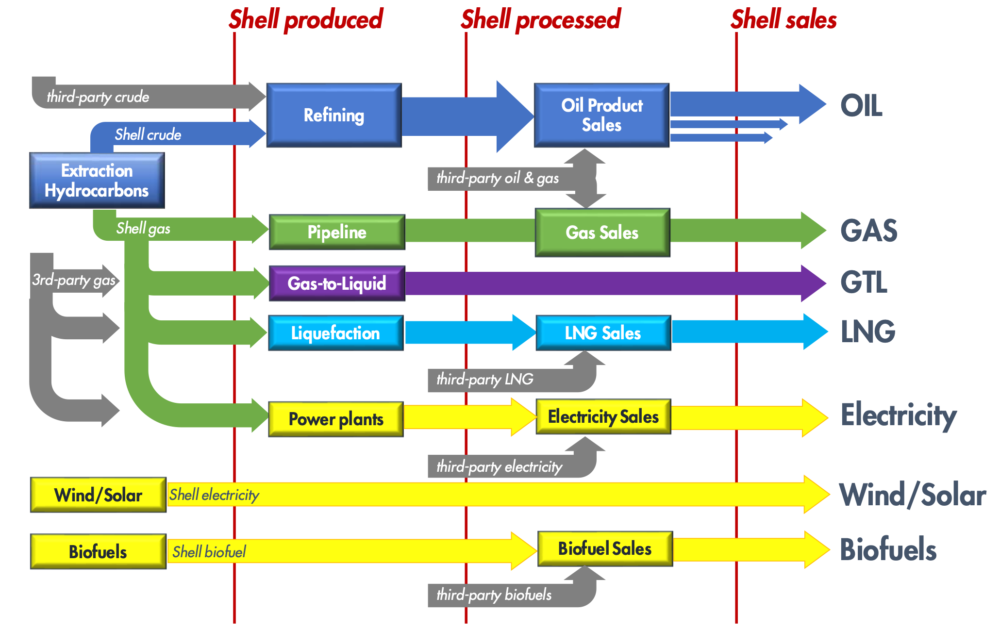
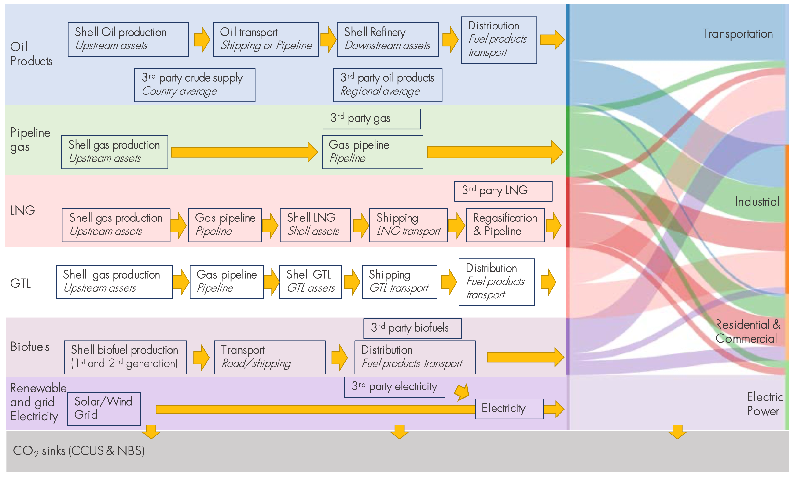
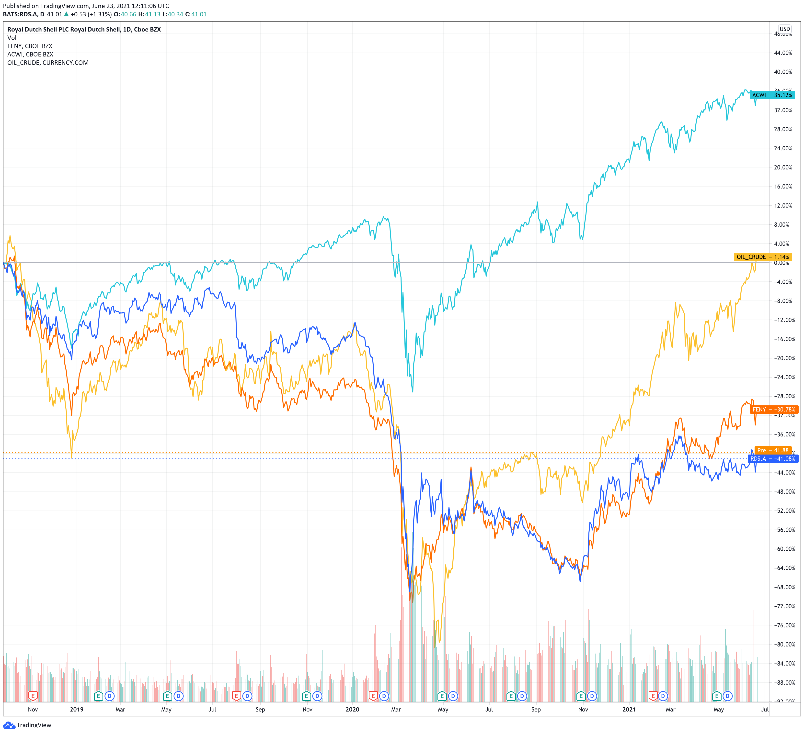
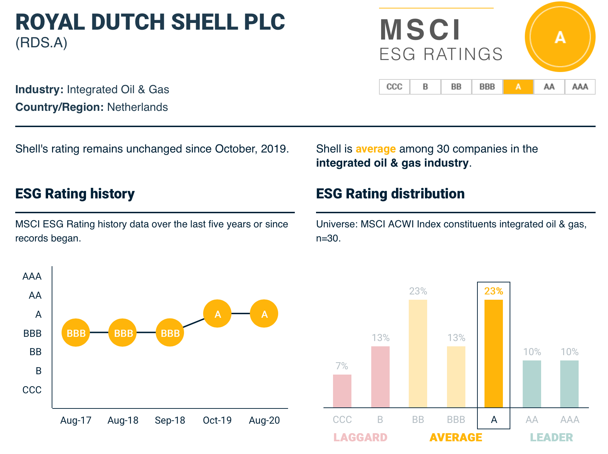
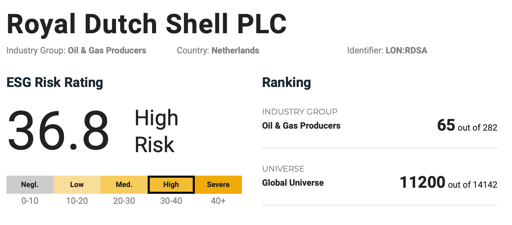
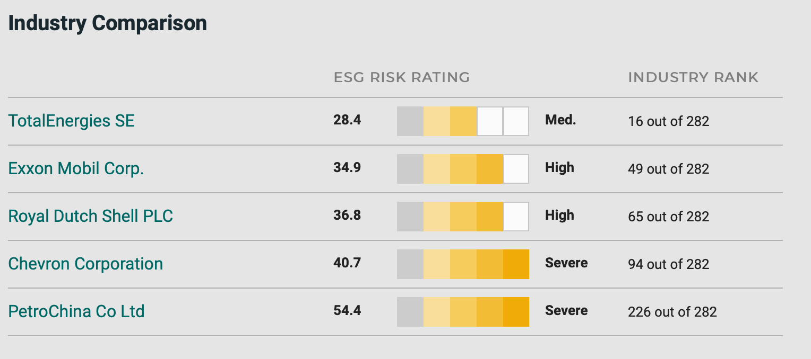

# Shell és a karbonsemlegesség

Amikor 2020 tavaszán leállt a gazdasaág, sokan aggodalommal figyelték, hogy a nagy újraindítás mennyire fogja háttérbe szorítani a klímaváltozás ellen tett addigi törekvéseket. Szerencsére úgy tűnik, hogy az elindított kezdeményezések nem vesztek kárba. 2020-ban és 2021-ben is nagyon népszerűek az ESG alapok és egyre többen keresik azokat a termékeket, amelyek fenntartható gazdaságokból származnak.
Vannak akik könnyebb helyzetben vannak. Elsősorban tech, és digitális szolgáltatásokat nyújtó cégek, nem meglepő, hogy elsőként ezek tettek igéreteket és vannak akik már bőven túlteljesítették az elvárt minimumot. A Google már 2030-ra elérheti a célt. [7]
Annál nehezebb dolga akad az olyan vállalatoknak, amelyek tevékenysége közvetlenül az üvegházhatás alapú gázok kibocsájtásához köthető. A Shell környékéről folyamatosan érkeznek az ezzel kapcsolatos hírek, amely jól tükrözi a helyzet fontosságát a cég berkein belül.

||

Íme néhány cím:
- A Shell osztalékot emel mert a profitja elvárásokon felüli (2020. Okt.) [1]
- A Shell bejelenti net zéró stratégiáját, és vállalja a teljesítését 2050-re (2020. Nov.) [2]
- További vállalásokat jelenek be a folyamat gyorsítása érdekében, közben megőrizve a cég pénzügyi stabilitását (2021. Feb.) [3]
- "Bíróság kötelezi a Shellt, hogy csökkentse a károsanyag-kibocsátását" (2021. Máj.) [5]
- A mexikói Pemex vállalat megveszi a texasi finomítót a Shelltől. [6]

A Shell publikált egy jól összeszedett dokumentumot arról, hogy hogyan mérik a kibocsájtás mértékét, amely az alapját adja a vállalásaiknak: [PDF](https://fourleafdigital.shell.com/webapps/climate_ambition/downloads/SR.19.00134.pdf)

Ez tartalmazza Shell teljes portfolióját, a nyersolajtól egészen a elektromos energiáig, beleértve a nap, és szélenergiát, a széndioxid befogására alkalmas eszközeiket (Carbon Capture and Storage - CCS), és a természetes lekötőket (nature-based solutions - NBS -› erdők). Ebben a dokumentumban még visszafogottabb vállalásokat említenek: 30%-os csökkenés 2035-re (ami már magasabb az eredeti 20%-nál amit 2017-ben tűztek ki) és 65% 2050-re. Később erre jött egy újabb közlemény, amiben már 20% áll 2030-ra, 45% 2035-re, és 100% 2050-re [3]. Van viszont néhány kitétel a dokumentumban:
1. A mérések a Shell által termelt üzemanyag emissziós intenzitást mérik.
2. Csak az energiahordozók által okozott kibocsájtásokat mérik (karbon intenzitás) a többi mellékterméket nem (kenőanyag, műanyag, bitumen, stb.)
3. A beszállítók által okozott károsanyag kibocsájtást(scope 3) nemzeti átlagát veszik a méréseknél, az adatok és a befolyás hiányára hivatkozva. 

Habár a dokumentum nagyon impresszív, és sokkal több mint amennyit egyes konkurensek készítettek - főleg az amerikai olajvállalatokra gondolva (Exxon Mobil, Chevron, stb.) - mégis egy negatív felhangú hír miatt került fókuszba a cégóriás: A holland bíróság elmarasztalta őket, mert nem elegendő a vállalások mértéke.

Íme néhány pontban összefoglalva, mit is határozott a bíróság [5,8]:
- A károsanyag emissziót vissza kell fogni a 2019-es mértekhez viszonyítva 45%-al 2030-ra. A shell 20%-ot vállalt a 2016-os alapadatokhoz képest.
- Ez a célszám az abszolút kibocsájtás mértékét jelenti. A fenti dokumentumban a cég termelés karbon intenzitását mérte. Csak nagyon röviden, az abszolút kibocsájtás értelemszerűen azt jelenti, hogy az össztermelés során mennyi káros anyag került a levegőbe, amíg a karbon intenzitás ezt egy egységnyi termék előállításához viszonyítja (pl. egy liter benzin mennyi CO2 kibocsájtással jár). Ha az utóbbit vesszük alapul, akkor amíg az nem nulla, addig akár azt is jelentheti, hogy összeségében nagyobb lesz az emisszió amennyiben a termelés növekszik [9].

Ezen felül a fent említett kitételek miatt további aggályok merülnek fel:
## Beszállítók
Általánosságban elfogadott, hogy a beszállítók által okozott emissziós mértéket nem, vagy csak elnagyolva veszik figyelembe. Ennek több oka is van. Az egyik, hogy nehéz pontos adatokat kapni, a másik pedig, hogy ha mindenki visszaszorítja az általa okozott emissziókat, akkor nem is kellene vele törődni, mert ami az egyiknek beszállító, az a másiknak a fő tevékenységi köre. A Shell esetében a termelési folyamat szinte minden pontján vannak külső beszállítók is (szürkével jelölve):

||
|:--:|
|<i>Shell portfoliójának 3 szakasza: kitermelés, feldolgozás, értékesítés</i>|

Tehát az egyik módszer az emisszió csökkentésére a kitermelés és feldogozás kiszervezése. Így akár még növelni is lehet a forgalmat, papíron mégis csökken a nettó kibocsájtás mértéke. Könnyű látni, hogy így viszont gyorsan eljuthat az ellátási lánc olyan országokba, ahol kisebb a transzparencia, esetlegesen nem is ratifikálta a párizsi egyezményt, viszont ez a globális felmelegedés problémáján egyáltalán nem segít.

Shell az idén eladta a texasi finomítójának 100%-os tulajdon jogát a mexikói Pemex vállalatnak, így már csak az értékesítésnél számolnak az emisszióval.

## Megrekedt eszközök
Egyre többen foglalkoznak azzal a problémával, hogy a piacon sok az úgynevezett megrekedt eszköz (stranded assets), amely hibásan van beárazva ezekbe a folyamatokba. Az energiapiacon ilyen eszköznek tekinthetőek azok az olaj tartalékok, amelyek kitermelése esetén nem tartható a Párizsi Egyezmény, mégis jelenleg jelentős értéket képviselnek a tulajdonos portfoliójában. De akár ide sorolható az az infrastruktúra is amely a kitermelésben, feldolgozásban és értékesítésben játszik szerepet: Olajkutak, finomítók, benzinkutak, stb. Várható, hogy egyre több tőkét vonnak ki ezekből az eszközökből, úgy fog csökkenni az értéke. A kérdés, hogy hogyan tudják majd a cégek úgy átszervezni az eszközeiket, hogy fenntartsák a növekedést, és közben eleget is tegyenek a vállalásaiknak is.

## Melléktermékek
A fent említett kitételek második pontja alapján a nem energia alapú termékek nem részei a vállalásoknak. Ide tartozik a műanyag is, amely szintén dobogós helyen van a Föld ökoszisztémájának tönkretételében. 2019-es adatok szerint kb. 1.5 milliárd dollár összeg folyt be annak a szövetségnek amelyet a műanyag gyártók alapítottak a műanyag szemét elleni védekezésre (Alliance To End Plastic Waste), szemben azzal a 204 milliárd dollárral amely a műanyag gyártás fejlesztéseibe fektettek. Jelenleg a műanyag legnagyobb hányada az egyszer használatos csomagolásokat képezik amelyek gyorsan a szeméttelepeken végzik. Csak 14%-át hasznosítják újra, és 2% az amiből ugyanolyan minőségű terméket állítanak elő. 14%-át elégetik, amely jelentősen légszennyezést okoz, a többi pedig vagy szeméttelepen vagy a természek körforgásában marad. Mivel a műanyag gyártás a kőolaj finomítás egyik mellékterméke, várható, hogy fosszilis energiahordozók csökkenéséből eredő bevétel veszteségek egy részét fedezni fogják a műanyag gyártás növelésével. Ez szintén nem sok segítség a Föld megmentésében.

## Karbon-ellensúlyozás (Carbon offsetting)
Ahogyan a legtöbb vállalás végződik, a Shell-nél is ugyanaz a helyzet: Befektetni az ún. karbon elnyelő rendszerekbe, ellensúlyozva a kibocsájtás mennyiségét:

||
|:--:|
|<i>Karbon elnyelők az emisszió ellensúlyozására</i>|

Ezeket az eszközöknek két nagy kategóriája létezik: 
- **mesterséges**: Gépekkel kivonni a széndioxidot a levegőből
- **természetes**: Erdők telepítése

A részleteket mellőzve, röviden egyenlőre az a helyzet, hogy nincs olyan szerkezet, amely hatékonyan ki tudná vonni a CO2-t a levegőből, erdőből pedig nem tudunk annyit ültetni, amennyi kellene, ráadásul más problémákhoz vezetne ha telenyomnánk fákkal a szárazföldet. Bővebben itt: [Climate scientists: concept of net zero is a dangerous trap](https://theconversation.com/climate-scientists-concept-of-net-zero-is-a-dangerous-trap-157368).
A Shell több olajcéggel összefogva dolgozik egy karbon elfogó rendszeren, [Quest CCS](https://www.shell.ca/en_ca/about-us/projects-and-sites/quest-carbon-capture-and-storage-project.html), amely a feldolgozás során keletkezett CO2-t fogja fel, és küldik a föld mélyére, de ez is egyenlőre kísérleti fázisban van, és nem a levegőből veszi ki, hanem a kéményekből.

## Végszó
Mint a fentiekből kiderül, a helyzet bonyolultabb annál, hogy egyszerű következtetéseket le tudjunk vonni. Elkezdhetnénk mutogatni az olajtársaságokra, de az a helyzet, hogy alapvető igényt elégítenek ki, és amíg nincs megoldás hogyan váltjatjuk ki tömegesen, és fenntarthatóan az emberek energia éhségét fenntartható forrásokból addig szükség van fosszilis tüzelőanyagra. Mindannyian szeretünk hazamenni a meleg szobába télen, és elrepülni egzotikus tájakra. Amikor elmegy az áram otthon, nem azt nézzük meg hogy mikor süt ki a nap, hanem idegesen felhívjuk a szolgáltatót. 
A cégnek valahogyan biztosítani kell a növekedést miközben a szigorításoknak is be kell tartani.
Egyenlőre befektetési oldalról sem mozgatta meg a piacot ezek a történések ami érthető mivel a járvány sokkal nagyobb erővel csapott oda:

||
|:--:|
|<i>Shell árfolyam változása az elmúlt évben(RDS.A)</i>|

Amint a fenti ábrán látszik a Shell(RDS.A) árfolyama együtt mozog az energiapiaci indexxel (FENY), lemaradva mint az olaj árától, mint a világpiaci indextől.
A vállalat ESG besorolása is belesimul az energipiac többi szereplői közé, és nem történtek számottevő változások:
(Források: [MSCI](https://www.msci.com/our-solutions/esg-investing/esg-ratings/esg-ratings-corporate-search-tool/issuer/royal-dutch-shell-plc/IID000000002137074), [Sustainalytics](https://www.sustainalytics.com/esg-rating/royal-dutch-shell-plc/1030264212/)

Az biztos, hogy a történetnek itt még nincs vége. Sokan kíváncsian várják, hogy miként reagálnak a legnagyobb szereplők a klímaválozás ellen tett törekvésekre. Nagy rengéseket biztosan nem okoznak ezek a hírek, de hosszútávon nagyon fontos lesz, hogy hogyan tudnak alkalmazkodni a jelenlegi trendekhez.

||
|:--:|
|<i>Shell MSCI ESG besorolása</i>|

||
|:--:|
|<i>Sustainalytics ESG pontszáma</i>|

||
|:--:|
|<i>Sustainalytics energiapiaci pontszámok</i>|

(1) Jillian Ambrose, Energy correspondent, 2020. Okt.
[Shell raises dividends as profits beat expectations](https://www.theguardian.com/business/2020/oct/29/shell-dividends-oil-investors-third-quarter-results)

(2) Shell, 2020. Nov.
[Our climate ambition, Shell is aiming to become a net-zero emissions energy business by 2050 or sooner](https://www.shell.co.uk/a-cleaner-energy-future/our-response-to-climate-change/shells-ambition-to-be-a-net-zero-emissions-energy-business.html#iframe=L3dlYmFwcHMvY2xpbWF0ZV9hbWJpdGlvbl9VS19uZXRfemVyby8)

(3) Shell, 2021. Feb.
[Shell accelerates drive for net-zero emissions with customer-first strategy](https://www.shell.com/media/news-and-media-releases/2021/shell-accelerates-drive-for-net-zero-emissions-with-customer-first-strategy.html)

(4) Shell, 2020. Máj.
[CSATLAKOZZON KARBONSEMLEGESÍTÉSI PROGRAMUNKHOZ!](https://www.shell.hu/autosok/karbonsemlegesitesi-program.html)

(5) Csurgó Dénes, 444.hu, 2021. Máj.
[Bíróság kötelezi a Shellt, hogy csökkentse a károsanyag-kibocsátását](https://444.hu/2021/05/26/birosag-kotelezi-a-shellt-hogy-csokkentse-a-karosanyag-kibocsatasat)

(6) Reuters, 2021. Máj.
[Mexico's Pemex buys 100% stake in Texas refinery from partner Shell](https://www.reuters.com/article/mexico-pemex-shell-idUSE1N2M900O)

(7) Darrell Etherington, Techcrunch, 2020. Szept.
[Google claims net zero carbon footprint over its entire lifetime, aims to only use carbon-free energy by 2030](https://uk.news.yahoo.com/google-claims-net-zero-carbon-111153638.html)

(8) Peter Dejong, REUTERS, 2020. Dec.
[Explainer: What the Dutch court carbon emissions ruling means for Shell](https://www.reuters.com/business/sustainable-business/what-dutch-court-carbon-emissions-ruling-means-shell-2021-05-26/)

(9) Hunter Donovan, ADEC Innovations, 2019. Márc.
[ABSOLUTE VS INTENSITY: HOW ARE YOU SETTING SCIENCE-BASED TARGETS?](https://info.esg.adec-innovations.com/blog/absolute-vs-intensity-how-are-you-setting-science-based-targets)